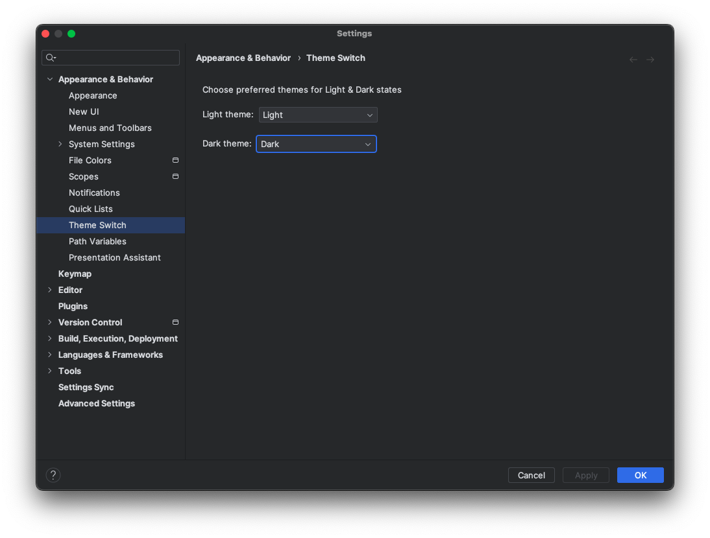

    
    &nbsp;
    

# Switch the theme in one click!

The plugin enables you to switch themes fast. When you are in bright sun - you need a white theme, when you are in 
a dark room you need a dark theme. No more searching for the settings in preferences, just one click, and you are 
all set up.👩‍💻

# Version

1.1.0

# Supported themes

For default plugin uses two default IntelliJ themes for light and dark states: 
- **Light state:** IntelliJ IDEA Light
- **Dark state:** Darcula

Plugin supports choosing own themes for light and dark states. You can do it in _Settings -> Appearance & Behavior
-> Theme Switch_.

# Plugin screenshots

")

")

 

Enjoy,

Ilya Bykov
